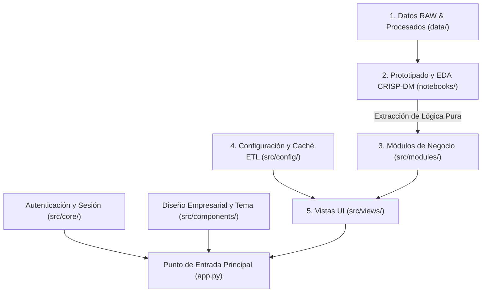

# Guía de Arquitectura y Desarrollo — AgroLab Dashboard

Esta guía define los estándares de arquitectura, el flujo de trabajo de desarrollo y las convenciones de código para los integrantes del proyecto **AgroLab Dashboard**.

---

## 1. Arquitectura del Sistema (Clean Architecture en 5 Capas)

El proyecto sigue estrictamente una Arquitectura Limpia dividida en 5 capas. La lógica de negocio, el procesamiento de datos, las vistas de presentación y la configuración del sistema están desacopladas para permitir el desarrollo en paralelo del equipo sin conflictos de código.



### Matriz de Responsabilidad por Capa

1. **`data/`**:
   - `data/raw/`: Contiene los datasets originales inmutables (`BD_lab_28-8-26.xlsx` y `sample_agro_data.csv`).
   - `data/processed/`: Contiene el dataset limpio oficial (`cleaned_agro_data.csv`, 8.149 registros validados). El diccionario formal de variables se documenta en [DATA_DICTIONARY.md](DATA_DICTIONARY.md).
2. **`notebooks/`**:
   - `01_eda_analytics_crisp_dm.ipynb`: Notebook analítico oficial estructurado bajo las 5 fases de la metodología **CRISP-DM**, con profiling visual (`missingno`), justificación de depuración, análisis por objetivo y prototipado de HUs.
3. **`src/config/`**:
   - `settings.py`: Resolución dinámica de rutas absolutas del proyecto, carga de configuraciones (`config.yaml`) y pipeline ETL en caché con `@st.cache_data`.
4. **`src/core/`**:
   - Infraestructura de seguridad (`auth.py` para autenticación RBAC con contraseñas encriptadas en `bcrypt` y `session.py` para ciclo de vida de la sesión).
5. **`src/components/`**:
   - Componentes estandarizados de UI (`theme.py` para tipografía Poppins, paleta monocromática y reglas CSS unificadas; `sidebar.py` para navegación y cierre de sesión).
6. **`src/modules/`**:
   - Capa de lógica de negocio pura en Python sin dependencias de UI (cálculo de recencia, perfil agronómico, Pareto, percentiles P75/P90 de capacidad y quintiles RFM en 5 categorías).
7. **`src/views/`**:
   - Controladores de vista en Streamlit que consumen `src/modules/` y renderizan las pantallas analíticas con widgets interactivos y gráficos Plotly.
8. **`app.py`**:
   - Punto de entrada raíz, enrutador principal de vistas y guardián de autenticación.

---

## 2. Mapeo de Historias de Usuario (HU-01, HU-02, HU-03)

El proyecto se estructura en tres módulos independientes correspondientes a las Historias de Usuario y los 4 Objetivos de Negocio:

| Historia de Usuario | Objetivos Cubiertos | Archivo de Vista (`src/views/`) | Módulo de Negocio (`src/modules/`) | Criterios Funcionales y Reglas de Negocio |
|---|---|---|---|---|
| **HU-01: Clientes Frecuentes** | **Objetivo 1** | `frequent_clients_churn.py` | `frequent_clients_churn/` | • Ranking interactivo de clientes por volumen de muestras descendente.<br/>• Filtros dinámicos por rango de fechas, estado de actividad (Activos/Inactivos con ventana de 90 días), **filtro multi-especie** y **perfil agronómico (Estacional vs. Mixto)**.<br/>• Tarjeta de Cliente Líder por ID (`Cliente #{id_cliente}`) y tabla con recencia en días (sin columna Razón Social y sin exclusión de ID > 50.000). |
| **HU-02: Cultivos y Capacidad** | **Objetivos 2 y 3** | `crop_capacity.py` | `crop_capacity/` | • Distribución por especie (Pareto Top 10 + "Otras") con alternancia Barras/Dona.<br/>• **Gráfico 1: Capacidad Operativa y Alertas del Laboratorio**: Volumen consolidado (todas las especies) con umbrales fijos en **142 (Alerta Operativa)** y **191 (Cuello de Botella)**.<br/>• **Gráfico 2: Patrón de Estacionalidad (Trigo y Soja)**: Curvas continuas sin alertas para analizar complementariedad de zafras (fina vs. gruesa).<br/>• Desestimación justificada del desglose por tipo de ensayo por inconsistencia agregada en `tipo_analisis`. |
| **HU-03: Segmentación RFM** | **Objetivo 4** | `rfm_segmentation.py` | `rfm_segmentation/` | • Scoring RFM por quintiles (1 al 5) sobre el 100% de la cartera (sin filtros arbitrarios de convenios).<br/>• Clasificación en las **5 categorías oficiales de negocio**: `Campeones`, `Fieles / Alto Valor`, `Potenciales`, `En Riesgo` y `Perdidos`.<br/>• **Listado de Contactos Urgentes (Cuentas en Riesgo)** con impacto monetario y acción comercial recomendada para mitigación de fuga.<br/>• Distribución de fracciones de cartera con paleta corporativa y Matriz RFM 2D. |

---

## 3. Flujo de Trabajo Paso a Paso para Desarrolladores

Para mantener la calidad del código y prevenir conflictos de fusión (merge conflicts), se debe seguir este flujo de 4 pasos:

### Paso 1: Exploración y Prototipado en Notebooks (`notebooks/`)
1. Trabajar sobre el notebook oficial de referencia: `notebooks/01_eda_analytics_crisp_dm.ipynb`.
2. Validar que las fórmulas y transformaciones operen sobre el dataset depurado de 8.149 filas (`data/processed/cleaned_agro_data.csv`).
3. Verificar la consistencia visual y matemática de las agrupaciones antes de llevar la lógica a producción.

### Paso 2: Extracción de Lógica de Negocio (`src/modules/<nombre_modulo>/`)
1. Modularizar las fórmulas del notebook hacia funciones puras de Python dentro de `src/modules/<nombre_modulo>/calculator.py`.
2. Asegurarse de que cada función sea pura: recibe parámetros o DataFrames y retorna DataFrames procesados, diccionarios o métricas escalares.

> **Regla Estricta:** Nunca importar ni ejecutar funciones de Streamlit (`st.write`, `st.sidebar`, `st.plotly_chart`) dentro de `src/modules/`. La capa de negocio debe ser 100% agnóstica de la interfaz de usuario.

### Paso 3: Ensamblado de la Vista Streamlit (`src/views/<nombre_modulo>.py`)
1. Implementar o actualizar el controlador de vista correspondiente.
2. Cargar los datos utilizando `load_agronomic_data()` desde `src.config.settings`.
3. Invocar la lógica de negocio desde `src.modules.<nombre_modulo>`.
4. Renderizar widgets interactivos (`st.selectbox`, `st.date_input`, `st.dataframe`, `st.plotly_chart`) respetando el sistema de diseño monocromático y las alertas consistentes.

### Paso 4: Verificación Automatizada con Tests (`tests/`)
1. Ejecutar la suite completa de pruebas unitarias antes de cada commit:
   ```powershell
   python -m pytest -v
   ```
2. Asegurar que el 100% de los tests pasen (mínimo 20 tests existentes que cubren ETL, HU-01, HU-02 y HU-03).

---

## 4. Estándares de Código y Directivas de Ingeniería

1. **Política de Cero Emojis en Código e Interfaz:**
   - No incluir emojis en etiquetas de UI, encabezados, títulos de métricas o notificaciones.
   - Utilizar íconos de Material Symbols mediante los parámetros nativos de Streamlit (`icon=":material/analytics:"`) o títulos de texto limpios.

2. **Convención de Idiomas:**
   - **Código Fuente y Comentarios Técnicos:** Python PEP 8, nombres de funciones, variables internas y docstrings en **Inglés**.
   - **Interfaz de Usuario (UI) y Textos Visibles:** Cadenas presentadas al usuario final (etiquetas, botones, tablas, leyendas, alertas) en **Español**.

3. **Inmutabilidad y Caché de Datos:**
   - Cargar siempre los datos mediante `load_agronomic_data()` desde `src.config.settings` con caché activo (`@st.cache_data`).
   - No mutar objetos DataFrame globales en memoria; utilizar `.copy()` al aplicar filtros dinámicos.

4. **Tratamiento Equitativo de Clientes:**
   - No aplicar filtros arbitrarios de exclusión por ID (`id_cliente > 50.000`). Toda la cartera histórica de clientes es válida y analizada uniformemente.
