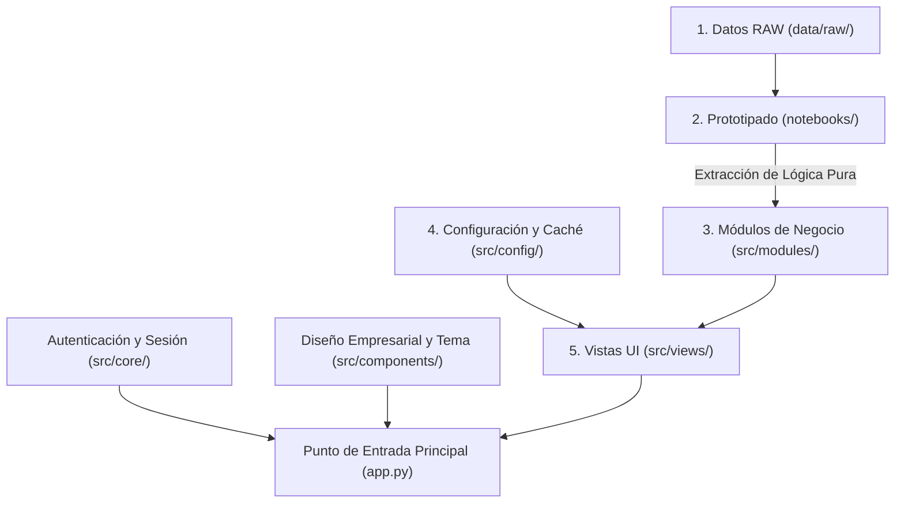

# Guía de Arquitectura y Desarrollo — AgroLab Dashboard

Esta guía define los estándares de arquitectura, el flujo de trabajo de desarrollo y las convenciones de código para los integrantes del proyecto **AgroLab Dashboard**.

---

## 1. Arquitectura del Sistema (Clean Architecture en 5 Capas)

El proyecto sigue estrictamente una Arquitectura Limpia dividida en 5 capas. La lógica de negocio, el procesamiento de datos, las vistas de presentación y la configuración del sistema están desvinculados para permitir el desarrollo en paralelo del equipo sin conflictos de código.



### Matriz de Responsabilidad por Capa

1. **`data/raw/`**: Contiene los datasets originales e inmutables (`BD_lab_28-8-26.xlsx` y `sample_agro_data.csv`). El diccionario formal de variables se documenta en [DATA_DICTIONARY.md](file:///C:/Users/Juan/Desktop/app-agro-lab/DATA_DICTIONARY.md).
2. **`notebooks/`**: Sandbox para Análisis Exploratorio de Datos (EDA) y prototipado de cálculos y gráficos.
3. **`src/config/`**: Configuración del sistema (`settings.py`), resolución de rutas absolutas y carga en caché de datos con `@st.cache_data`.
4. **`src/core/`**: Infraestructura de seguridad (`auth.py` para autenticación RBAC con bcrypt y `session.py` para el ciclo de vida de la sesión).
5. **`src/components/`**: Componentes estandarizados de UI (`theme.py` para tipografía Poppins y reglas CSS, `sidebar.py` para navegación).
6. **`src/modules/`**: Capa de lógica de negocio pura en Python (scoring RFM, cálculos de churn, umbrales de capacidad).
7. **`src/views/`**: Controladores de vista en Streamlit que ensamblan los datos de `src/modules/` en dashboards visuales.
8. **`app.py`**: Punto de entrada raíz y enrutador principal.

---

## 2. Mapeo de Historias de Usuario (HU-01, HU-02, HU-03)

El proyecto se estructura en tres módulos independientes correspondientes a las Historias de Usuario definidas:

| Historia de Usuario | Etiqueta en Sidebar | Archivo de Vista (`src/views/`) | Módulo de Negocio (`src/modules/`) | Criterios Funcionales y Requerimientos |
|---|---|---|---|---|
| **HU-01 (Objetivo 1)** | Clientes Frecuentes | `frequent_clients_churn.py` | `frequent_clients_churn/` | • Ranking interactivo de clientes ordenados por volumen de muestras (descendente).<br/>• Filtros dinámicos por rango de fechas, estado de cuenta (Activos/Inactivos) y **filtro multi-especie** (`st.multiselect`).<br/>• Exclusión opcional de convenios (`id_cliente > 50.000`). |
| **HU-02 (Objetivos 2 y 3)** | Cultivos y Capacidad | `crop_capacity.py` | `crop_capacity/` | • Distribución por especie (Pareto Top 10 + "Otras") con alternancia Barras/Dona.<br/>• **Gráfico unificado de evolución temporal continua**: Soja y Trigo preseleccionados por defecto, selector multi-cultivo y superposición de Total Consolidado.<br/>• Alertas de capacidad operativa (75% advertencia, 90% saturación) y simulador What-If.<br/>• Intervalos críticos de ensayos analíticos de mayor demanda. |
| **HU-03 (Objetivo 4)** | Segmentación RFM | `rfm_segmentation.py` | `rfm_segmentation/` | • Scoring RFM de 3 dígitos (111 al 555) mediante quintiles de Recencia, Frecuencia y Valor Monetario (Ciclo 25/26).<br/>• **Alerta de Churn y Riesgo Comercial** para cuentas clave con baja recencia (`R <= 2`, `F/M >= 4`).<br/>• Matriz Térmica 5x5 RF en escala `Greys` (Clientes / Facturación).<br/>• Tabla de cartera completa con filtro multi-segmento y buscador. |

---

## 3. Flujo de Trabajo Paso a Paso para Desarrolladores

Para mantener la calidad del código y prevenir conflictos al fusionar cambios (merge conflicts), cada desarrollador debe seguir este flujo de 3 fases:

### Fase 1: Prototipado en Jupyter Notebooks (`notebooks/`)
1. Crea o utiliza un notebook dentro de `notebooks/` (ej: `HU01_prototipado.ipynb`).
2. Carga el dataset desde `data/raw/sample_agro_data.csv`.
3. Desarrolla y valida las fórmulas, filtros de fechas, agrupaciones y prototipos de gráficos en Plotly/Matplotlib.

### Fase 2: Extracción de Lógica de Negocio (`src/modules/<nombre_modulo>/`)
1. Extrae las fórmulas de cálculo del notebook hacia funciones puras de Python dentro de `src/modules/<nombre_modulo>/`.
2. Crea archivos auxiliares si es necesario (ej: `src/modules/frequent_clients_churn/calculator.py`).
3. Asegúrate de que cada función sea pura: recibe parámetros o DataFrames y retorna DataFrames procesados, diccionarios o figuras de gráficos.

> **Regla Estricta:** Nunca importes ni ejecutes funciones de Streamlit (`st.write`, `st.sidebar`, `st.plotly_chart`) dentro de `src/modules/`. Los módulos deben ser 100% independientes del framework visual.

### Fase 3: Ensamblado de la Vista Streamlit (`src/views/<nombre_modulo>.py`)
1. Abre el controlador de vista correspondiente (ej: `src/views/frequent_clients_churn.py`).
2. Carga los datos utilizando `load_agronomic_data()` desde `src.config.settings`.
3. Llama a las funciones de negocio desde `src.modules.<nombre_modulo>`.
4. Renderiza los widgets interactivos (`st.selectbox`, `st.date_input`, `st.dataframe`, `st.plotly_chart`).

---

## 4. Estándares de Código y Recomendaciones para Pair Programming con IA

Si tú o tu equipo utilizan asistentes de código con IA (como Antigravity, Gemini, ChatGPT, Claude o GitHub Copilot), apliquen las siguientes directivas en sus prompts y revisiones de código.

### Template Base de Prompt para IA
Al solicitar asistencia a un modelo de IA para generar código, copia y pega este contexto base:

```text
Contexto de Arquitectura del Proyecto:
- Proyecto: AgroLab Dashboard (Streamlit en arquitectura limpia de 5 capas).
- Idioma de código: Python (PEP 8, docstrings e identificadores en inglés).
- Ruta del módulo: src/modules/<nombre_modulo>/
- Ruta de la vista: src/views/<nombre_modulo>.py
- Idioma de la Interfaz (UI): Textos en español para títulos, etiquetas, tooltips y métricas.
- Reglas de Estilo UI: Cero emojis en la interfaz/documentación, paleta monocromática corporativa (blanco #FFFFFF, gris claro #F8FAFC, pizarra oscuro #111827).
- Restricciones: No incluir llamadas de Streamlit en src/modules/. No hardcodear rutas de archivos; usar src.config.settings.
```

### Directivas Clave de Ingeniería

1. **Política de Cero Emojis**:
   - No incluir emojis en etiquetas de UI, encabezados, títulos de métricas, notificaciones o documentación markdown.
   - Utilizar íconos de Material Symbols mediante los parámetros nativos de Streamlit (`icon=":material/bar_chart:"`) o encabezados de texto limpios.

2. **Separación de Idioma**:
   - **Código y Documentación Técnica:** Código en Python, nombres de variables, funciones, nombres de archivos, paquetes y docstrings deben estar en **Inglés**.
   - **Interfaz de Usuario (UI):** Cadenas visibles para el usuario (etiquetas, títulos, leyendas, tooltips, mensajes de alerta) deben estar en **Español**.

3. **Inmutabilidad y Caché de Datos**:
   - Cargar siempre los datos mediante `load_agronomic_data()` desde `src.config.settings`, el cual utiliza la memoria caché de Streamlit (`@st.cache_data`).
   - No mutar objetos DataFrame globales directamente; crear copias (`df.copy()`) al aplicar filtros dinámicos del usuario.

4. **Cero Código Muerto y Cumplimiento PEP 8**:
   - No dejar bloques de código legado comentados ni importaciones sin uso.
   - Mantener el estilo PEP 8: sangría de 4 espacios, nombres claros de variables, type hints (`df: pd.DataFrame -> pd.DataFrame`) y docstrings concisos.
